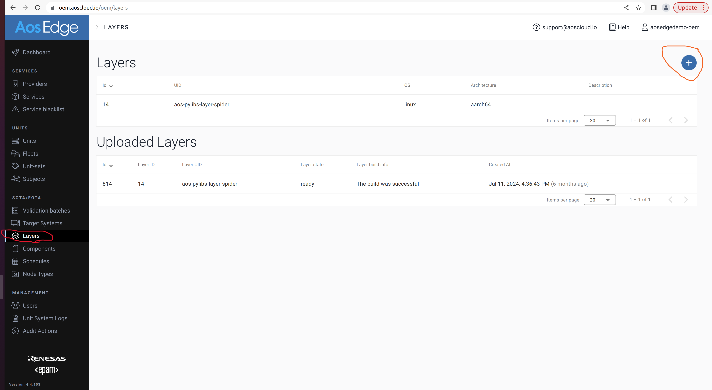
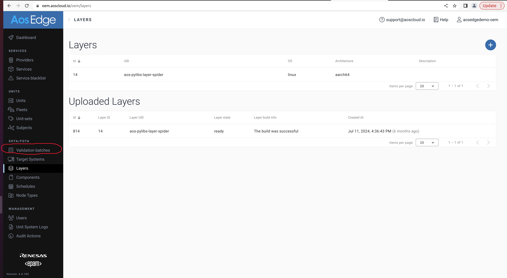

# Demo Services
The tool has been developed to gather information from cockpit and
send it to https://demo-insurance.aoscloud.io/.

# Install tool at AosEdg
## Required precondition(s)
- the following python layer has to be compiled and installed: **aos-pylibs-layer-spider**.


The information how to create and add the layer can be found \
at https://docs.aosedge.tech/docs/how-to/create-layer \
Shortly the following steps have to be done:

### Build the  aos-pylibs-layer-spider

Use the meta-aos layer. Path: https://https://github.com/aosedge/meta-aos

Recipe: meta-aos/recipes-aos-layers/aos-pylibs-layer/aos-pylibs-layer.bb

### Upload layer
#### Precondition
User must have OEM permissions to login into aoscloud.io.

- Login into https://aoscloud.io as OEM user.
- Go to the tab 'Layers' (see RED circle at the picture below)
- Then click on '+' (see orange circle at the piscture - top right corner)



# Configuration AosEdge
The information how prepare AosEdge to install the demo-insurance service \
can be found at https://docs.aosedge.tech/docs/quick-start.

## Install required tools at host machine.
pip3 install aos-prov -U

## Steps to upload service.
### demo_insurance
#### Set the correct service UUID
Firstly, it is necessary to make the modifications in the code of the demo_insurancein 
file ./demo_insurance/meta/config.yaml

url: aoscloud.io
```
service_uid: d75bf5cd-cef0-40f7-9e74-73ce49df2bcb
```
tls_pkcs12: aos-user-sp.p12

### Certificates
- Service provider certificat : aos-user-sp.p12
- OEM user certificat: aos-user-oem.p12

### Sign the service
```
cd demo_insurance
ls
``` 

Output 

```
meta  src
```

run:
```
aos-signer sign
```

### Upload service 

run:
```
 aos-signer upload
```

### Validate service

- Login into https://demo-insurance.aoscloud.io/ as user 'OEM'
- Got to tab 'Validation batches' and click at the 'Waiting validation' and than click 'Approve'.



## Configuration of cockpit-rcar (release: v1.0.4 release)
The following configuration must be added to the Unit configuration

"nodes": [ \
        { \
            "nodeType": "Node0-Linux", \
            "priority": 1,
```
            "resources": [
                {
                    "name": "vis",
                    "hosts": [
                        {
                            "ip": "192.168.5.86",
                            "hostname": "wwwivi"
                        }
                    ]
                }
            ]
```
        },
.... \
]

Use tab 'Target Systems' \
