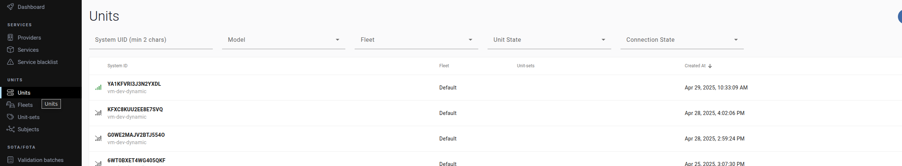
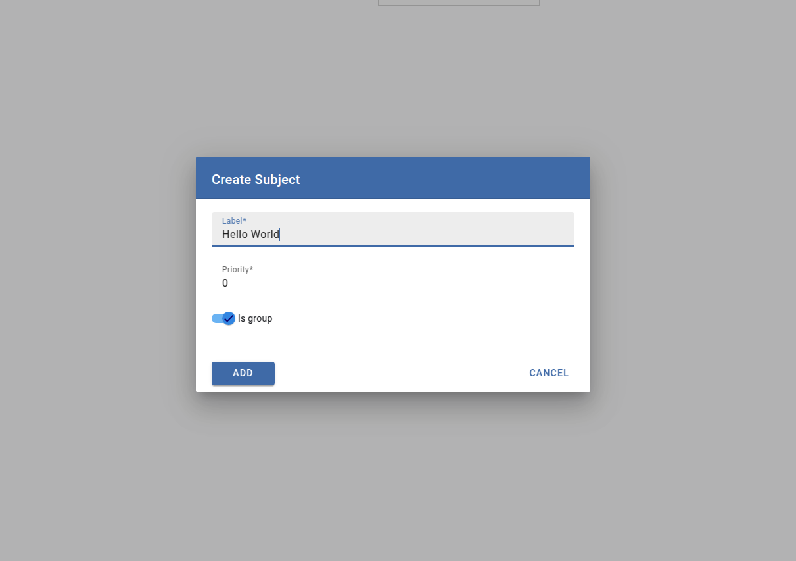
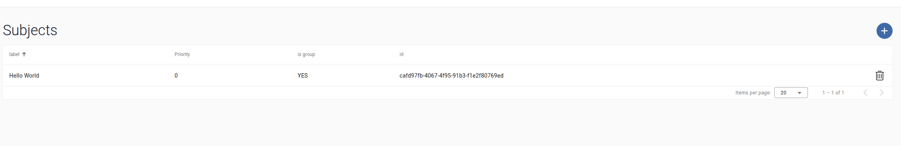
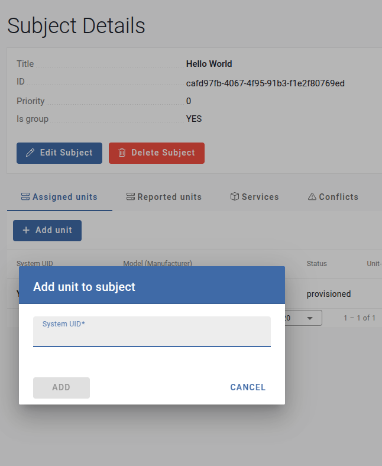
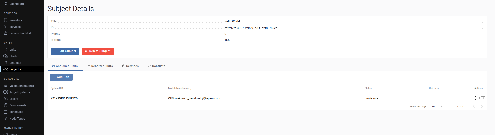
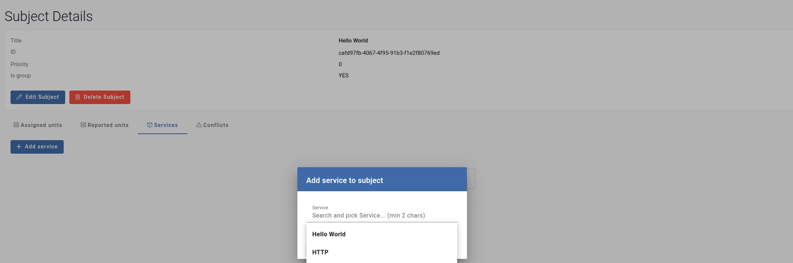
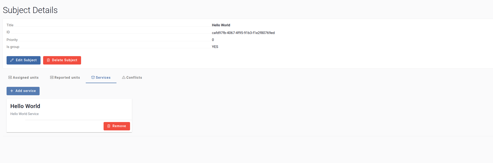

# AOS Edge Service - C++ Hello World Example

This repository contains a C++ Hello World example for building and deploying a service on the AOS Edge platform. Follow this guide to download and install the SDK, set up your environment, compile the service, create a service on AosCloud, and sign and upload the service version.

## Prerequisites

- **Development Environment**: A supported platform (VirtualBox or Raspberry Pi).
- **AosCloud Account**: An SP user account for AosCloud. See the AosEdge Dictionary for user types and the Get Access page for login help.
- **Tools**: Basic knowledge of CMake, Bash, and Python.
- **Dependencies**: Ensure `wget`, `python3`, and a virtual environment (`venv`) are installed.

## Download the SDK

Download the appropriate SDK toolchain for your development environment.

### VirtualBox Environment

```console
wget https://github.com/aosedge/meta-aos-vm/releases/download/v5.2.0-beta.5/aos-vm-dev-glibc-x86_64-aos-image-vm-core2-64-genericx86-64-toolchain-5.0.9.sh
```

### Raspberry Pi Environment

```console
wget https://github.com/aosedge/meta-aos-rpi/releases/latest/download/poky-glibc-x86_64-aos-image-rpi-cortexa76-raspberrypi5-toolchain-5.0.9.sh
```

## Install and Set Up the SDK

Install the SDK and configure the build environment.

### VirtualBox Environment

1. Make the SDK installer executable:

    ```console
    chmod +x aos-vm-dev-glibc-x86_64-aos-image-vm-core2-64-genericx86-64-toolchain-5.0.9.sh
    ```

2. Run the installer:

    ```console
    ./aos-vm-dev-glibc-x86_64-aos-image-vm-core2-64-genericx86-64-toolchain-5.0.9.sh
    ```

### Raspberry Pi Environment

1. Make the SDK installer executable:

   ```console
   chmod +x poky-glibc-x86_64-aos-image-rpi-cortexa76-raspberrypi5-toolchain-5.0.9.sh
   ```

2. Run the installer:

   ```console
   ./poky-glibc-x86_64-aos-image-rpi-cortexa76-raspberrypi5-toolchain-5.0.9.sh
   ```

## Initialize the SDK Environment

### VirtualBox Environment

```console
. /opt/aos-vm-dev/5.0.9/environment-setup-core2-64-aosvm-linux
```

### Raspberry Pi Environment

```console
. /opt/poky/5.0.9/environment-setup-cortexa76-poky-linux
```

## Compile a Service Example

### VirtualBox Environment

```console
x86_64-aosvm-linux-g++ --sysroot=/opt/aos-vm-dev/5.0.9/sysroots/core2-64-aosvm-linux main.cpp -o hello_world
```

### Raspberry Pi Environment

```console
aarch64-poky-linux-g++ --sysroot=/opt/poky/5.0.9/sysroots/cortexa76-poky-linux main.cpp -o hello_world
```

## Create a service on AosCloud site

To create the AosEdge service you've been logged in as an SP user. User types are defined on  [AosEdge dictionary](https://docs.aosedge.tech/docs/aos-edge/dictionary).If you have problems with the login, please refer to the [Get Access page](https://docs.aosedge.tech/docs/quick-start/get-access).

1. On AosCloud, go to Services and click the plus button in the top-right corner of the screen to start creating a service.
  

2. Enter all required values that are marked:
  

    - the service name under **Title**
    - a description under **Description**
    - required resources:
    - CPU DMIPS
    - RAM in kB
    - Storage in kB

3. Click **Add** to complete the service creation.

4. After creating the service, click its **Title** to access the **Service Detail** screen. Copy the value from the **UUID** field and save it for future use.  
   

## Prepare the Service for Upload

Before signing and uploading your service to AosCloud, prepare the service by organizing the compiled binary and updating the configuration with the service UUID obtained from the **Create a Service on AosCloud** step.

1. **Move the Compiled Service Binary**

   Copy or move the compiled `hello_world` binary to the service source directory:

   ```console
   mv hello_world ./service/src
   ```

   Ensure the binary is in the `./service/src` directory, as this is where the `aos-signer` tool expects it.

2. **Update the Service Configuration**

   Open the service configuration file `./service/meta/config.yaml` and update the `service_id` field with the **UUID** you copied from the **Service Detail** screen in AosCloud:

   ```console
   nano ./service/meta/config.yaml
   ```

   Example `config.yaml`:

   ```yaml
   service_id: <YOUR_SERVICE_UUID>
   # Other configuration fields...
   ```

   Replace `<YOUR_SERVICE_UUID>` with the UUID saved earlier. Save and close the file.

## Sign and Upload the Service Version

Use the `aos-signer` tool to sign and upload your service to AosCloud.

1. Jump to service folder.

```console
cd service
```

2. Sign the Service

In the service directory, run:

```console
~/.aos/venv/bin/python3 -m aos_signer sign
```

Expected output:

```code
Starting SERVICE SIGNING process...
Starting CONFIG VALIDATION process...
Validating config...
                        VALID
Copying application...
INFO: copying
...
Copying configuration...
                        DONE
Copying default state...
                        NOT REQUIRED by config
Creating archive...
                        DONE
Signing package...
                        DONE
Creating service package...
                        DONE
```

3. Upload the Service

Upload the signed `service.tar.gz` to AosCloud:

```console
~/.aos/venv/bin/python3 -m aos_signer upload
```

On success, the output ends with an **Uploaded** message. Verify the service details on the **Services** section of AosCloud.

# Creating a Subject

A **Subject** in AOS Cloud is a text identifier that links a service to a specific unit. Follow the steps below to create and configure a subject.

### Copy the System ID of the Unit
1. Navigate to the **[Units](https://oem.aoscloud.io/oem/units)** section in AOS Cloud.
2. Locate the desired unit and copy its **System ID**. This will be used in later steps.

   

### Create a New Subject
1. Go to the **[Subjects](https://oem.aoscloud.io/oem/subjects)** section.
2. Click the **+** button to create a new subject.
3. Enter a **Label ID** for the subject and save.

   

### Access the Subject
1. After creation, the new subject will appear in the subjects list.
2. Click on the subject you just created to configure it.

   

### Assign a Unit to the Subject
1. In the subject configuration, navigate to the **Assigned Units** tab.
2. Click **Add Unit**.
3. Paste the **System ID** copied in Step 1 and confirm.

   

4. The unit will now be associated with the subject.

   

### Assign a Service to the Subject
1. Navigate to the **Services** tab in the subject configuration.
2. Click **Add Service**.
3. Select the desired service from the available list and confirm.

   

4. The service will now be linked to the subject.

   


You have successfully created a subject in AOS Cloud, assigned a unit using its System ID, and linked a service to it. This configuration ensures that the specified service is associated with the designated unit via the subject.

## Approve Service

1. Go to [Validation Batches](https://oem.aoscloud.io/oem/validation-batches).  
2. Select your service.

   

3. Click **Approve** to confirm the service.

   

At this stage, the service is applied to our environment.

## Validate Result of the Service

1. Go to [Unit System Logs](https://oem.aoscloud.io/oem/unit-logs) and click the **+** button.  
   Fill in the required information to request logs.

   

2. Wait until the logs are available, then download them.

   

3. Open the log file in a text editor and search for the message `"Hello, World!!!"`.

   

If the message is found, the service is working correctly.  
